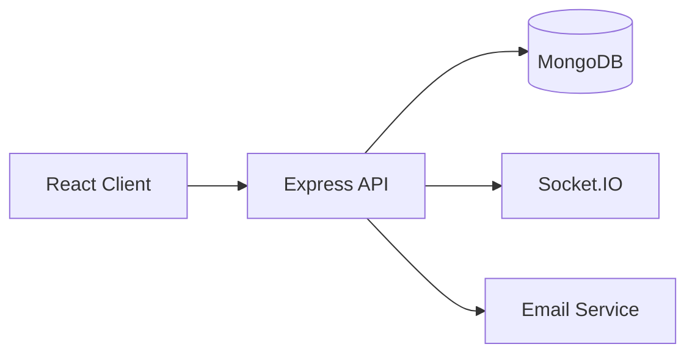
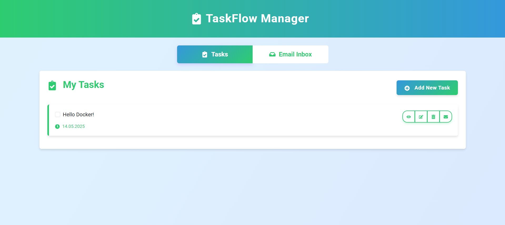
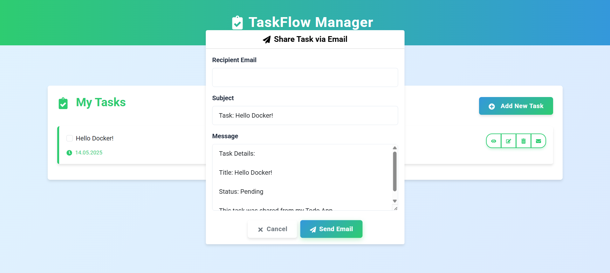
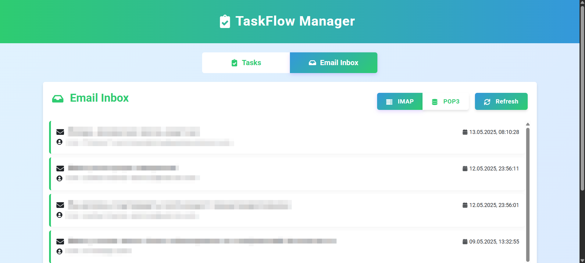
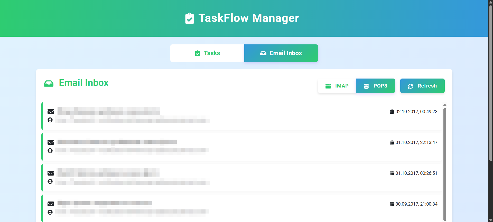

# ✅ Task Management System

A modern full-stack task management application supporting real-time collaboration, email integration, and containerized deployment.

The project demonstrates practical implementation of a scalable web application using modern backend and frontend technologies.

## 📌 Why This Project

* Demonstrates modern full-stack development
* Shows real-time client-server communication
* Implements containerized deployment and CI/CD
* Presents clean modular architecture

## ⚙️ Tech Stack

### Backend

* Node.js
* Express.js
* MongoDB
* Socket.IO

### Frontend

* React

### Infrastructure

* Docker
* GitHub Actions

## ✨ Feature Overview

* Task creation and management
* Real-time updates
* User authentication
* Email integration
* REST API
* Responsive web interface

## 🏗 Architecture

The application follows a client-server architecture:

* React frontend
* Express REST API
* MongoDB database
* Socket.IO real-time communication



## 🚀 Quick Start

```bash
docker compose up --build
```

## 📸 Demonstration

### Main application screen displaying the task list and core functionality.



### Interface for sharing a selected task via email.



### IMAP inbox screen displays all incoming emails retrieved using the IMAP protocol.



### POP3 inbox screen displays all incoming emails retrieved using the POP3 protocol.



## 🎯 Learning Outcomes

* Full-stack web development
* REST API implementation
* Real-time communication
* Docker containerization
* CI/CD workflows
